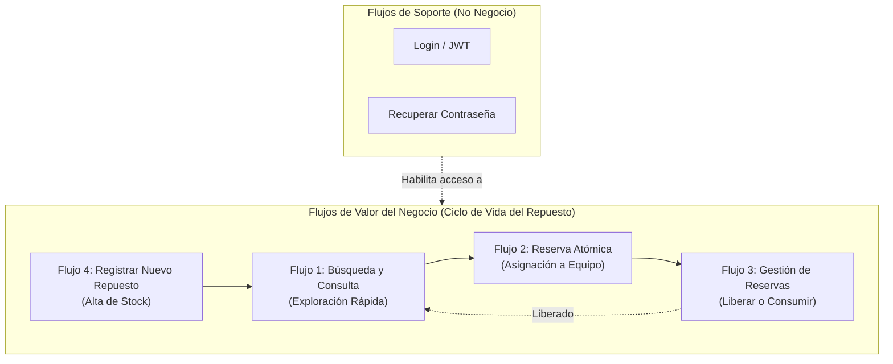

# Resumen Ejecutivo: Arquitectura de Flujos de Negocio vs. Flujos de Utilidad

> [!NOTE]
> **Propósito del Documento:** Validar la coherencia de los flujos de usuario implementados para el **Sistema de Gestión de Inventario y Taller (SGE)** bajo criterios de Interacción Humano-Computador (IHC), Usabilidad Móvil y Requerimientos del SRS v0.3.

---

## 1. Justificación de Producto: ¿Por qué Login y Recuperar Contraseña no cuentan como Flujos de Negocio?

En ingeniería de software e IHC, existe una distinción crítica entre **Flujos de Valor (Core Business Flows)** y **Flujos de Soporte/Higiene (Utility/Hygiene Flows)**:

- **Login / Password Recovery:** Son mecanismos de autenticación y seguridad necesarios pero no generan valor operativo por sí mismos. Un técnico no utiliza la app para autenticarse, sino para resolver el inventario de una reparación.
- **Flujos 1 al 4:** Representan el **100% del ciclo de vida físico y digital** de una pieza en el taller: desde que entra a la estantería, se busca, se reserva atómicamente, hasta que se instala o se libera.

---

## 2. Mapa Integral de los 4 Flujos Auditados

| Flujo | Denominación Oficial | RF Asociados | Propósito Principal en Taller |
|---|---|---|---|
| **Flujo 1** | **Búsqueda y Consulta de Repuestos** | RF-01, RF-02, RF-03 | Localización física inmediata (`Estante/Cajón`) y consulta de disponibilidad en tiempo real sin caminar por el taller. |
| **Flujo 2** | **Reserva Atómica para Reparación** | RF-04, RF-05, RNF-06 | Apartado exclusivo de la pieza para un equipo/cliente, previniendo colisiones entre técnicos. |
| **Flujo 3** | **Gestión de Reservas (Liberar / Consumir)** | RF-06, RF-07, RF-08 | Transición de estado: consumir pieza (reparación completada) o liberar al stock (diagnóstico descartado). |
| **Flujo 4** | **Registro de Nuevo Repuesto** | RF-09, RF-10 | Alta rápida de piezas nuevas o recuperadas con ubicación y código SKU. |

---

## 3. Matriz de Cumplimiento de Reglas de Experiencia Móvil

- **Regla del Pulgar (Thumb Zone):** Acciones críticas (Reservar, Guardar, Liberar) accesibles en la parte baja de la pantalla.
- **Regla de los 3 Toques:** Flujos clave resueltos en $\le 3$ toques desde la pantalla principal.
- **Resiliencia Visual (4 Estados de Borde):** Skeleton shimmer, estado vacío explicativo con acción, error con reintento y paginación protegida contra overflow.
- **Anti-Double Submit:** Bloqueo de botones de mutación con feedback visual durante peticiones de red.
