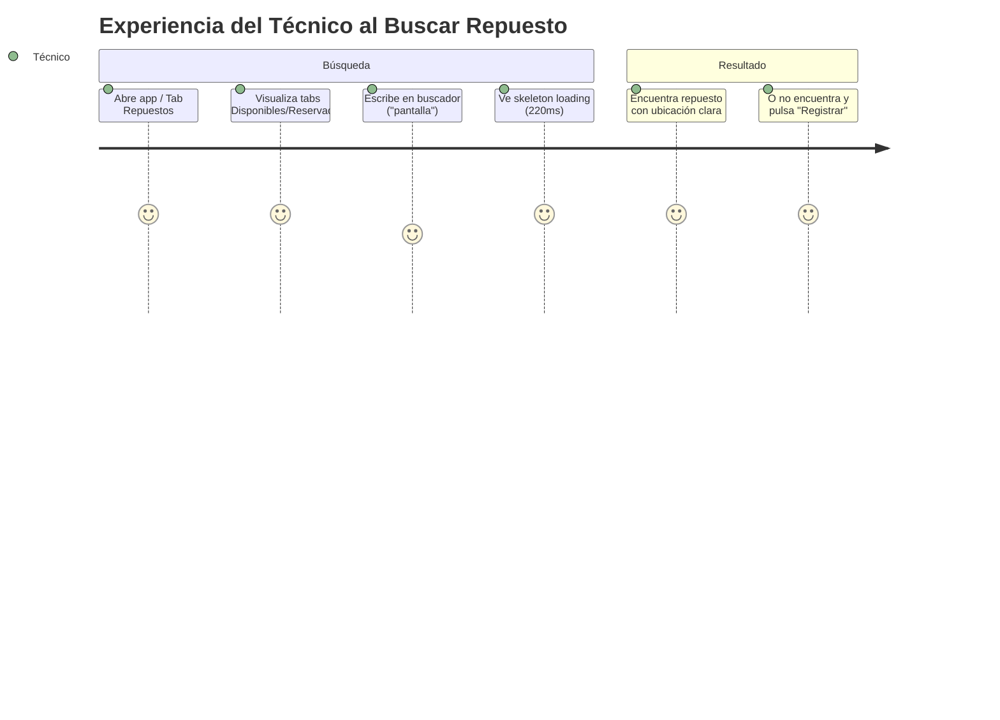

# Auditoría UX/UI & Product Management — Flujo 1: Búsqueda y Consulta de Repuestos

> [!INFO]
> **Alcance:** Pantalla principal de inventario (`repuestos_list_screen.dart`), pestañas de estado, debouncing en búsqueda, estados de borde (loading, empty, error) y vinculación con el alta de piezas.
> **Requerimientos SRS:** RF-01, RF-02, RF-03, RNF-05.

---

## 1. Análisis de Claridad y Fricción

| Elemento Auditado | Diagnóstico UX / Fricción Detectada | Nivel de Impacto | Heurística / Regla Asociada |
|---|---|---|---|
| **Separación de Tabs (Disponibles vs Reservados)** | ✅ **Claridad mental absoluta:** El técnico distingue al instante las piezas que puede tomar en mano de las ya comprometidas. Evita desplazamientos inútiles en el taller. | Positivo | Regla del Pulgar / Prevención de errores |
| **Buscador con Debounce (220ms)** | ✅ **Fluidez sin interrupciones:** No requiere presionar "Buscar" ni "Enter". El teclado virtual no interrumpe el flujo. | Positivo | Visibilidad del estado del sistema |
| **Resiliencia de Carga (Skeletons)** | ✅ **Sin saltos de layout:** El `RepuestoSkeletonCard` mantiene la estructura de la tarjeta mientras se resuelve la consulta. | Positivo | 4 Estados de Borde (Loading) |
| **Botón de Limpieza (X)** | ✅ **Ergonomía táctil:** Permite limpiar la caja de texto en 1 solo toque en lugar de presionar backspace múltiples veces. | Positivo | Flexibilidad y eficiencia de uso |

---

## 2. Lógica de Negocio y Casos de Borde (Edge Cases)

> [!WARNING]
> ### Caso 1: Búsqueda Sin Resultados (Zero Results)
> - **Comportamiento Actual:** Muestra la vista `RepuestoEmptyState` indicando *"No encontramos ese repuesto: '...' no está registrado todavía"*, acompañado del botón directo **"Registrar este Repuesto"**.
> - **Evaluación de Producto:** **Excelente puente de conversión.** Transforma un fallo de búsqueda en una llamada a la acción hacia el **Flujo 4 (Registro)**, transfiriendo automáticamente el texto buscado al formulario de alta.

> [!CAUTION]
> ### Caso 2: Pérdida de Conexión en Campo o Taller
> - **Comportamiento Actual:** El `RefreshIndicator` y el provider capturan errores de red mostrando un mensaje amigable y permitiendo reintentar con un gesto de arrastre hacia abajo.
> - **Evaluación:** Cumple con la regla de mensajes de error no técnicos (sin mostrar stack traces de Supabase/Dio al usuario).

---

## 3. Propuestas de Mejora y Recomendaciones de Producto

1. **Filtro Rápido por Chips de Categoría:**
   - Incorporar chips horizontales tipo píldora (`Todos`, `Pantallas`, `Baterías`, `Placas`) debajo del buscador para filtrar con el pulgar sin necesidad de abrir el teclado virtual.
2. **Escaneo Directo desde el Buscador:**
   - Colocar un icono de código de barras/QR en el `suffixIcon` del buscador para leer etiquetas físicas rápidamente.
3. **Resaltado de Ubicación Física:**
   - La ubicación física (`Estante B - Cajón 2`) es el dato más crítico para la motricidad del técnico. Debe tener un contraste reforzado con un icono indicador (`📍`).

---

## 4. Veredicto y Calificación

| Criterio | Puntuación | Observación |
|---|:---:|---|
| **Claridad de Interacción** | 9.5 / 10 | Sin pasos superfluos, navegación intuitiva. |
| **Resiliencia y Casos de Borde** | 9.0 / 10 | Excelente manejo de estados vacíos y reconexión. |
| **Ergonomía Móvil (Una Mano)** | 9.0 / 10 | Elementos interactivos principales al alcance del pulgar. |
| **Calificación Global** | **9.2 / 10** | **Aprobado con Alta Madurez.** |
