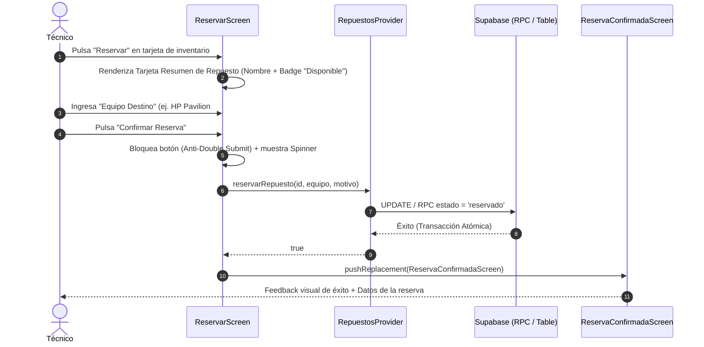

# Auditoría UX/UI & Product Management — Flujo 2: Reserva Atómica de Repuesto

> [!INFO]
> **Alcance:** Pantalla de formulario de reserva (`reservar_screen.dart`), pantalla de éxito (`reserva_confirmada_screen.dart`), control de colisión por concurrencia (RNF-06), prevención de doble envío y validaciones de negocio.
> **Requerimientos SRS:** RF-04, RF-05, RNF-06.

---

## 1. Análisis de Claridad y Fricción

| Elemento Auditado | Diagnóstico UX / Fricción Detectada | Nivel de Impacto | Heurística / Regla Asociada |
|---|---|---|---|
| **Tarjeta Resumen Superior** | ✅ **Confirmación contextual:** Muestra inmediatamente el repuesto seleccionado antes de pedir datos. El técnico nunca duda de qué pieza está reservando. | Positivo | Reconocimiento antes que recuerdo |
| **Campo "Equipo Destino" Obligatorio** | ✅ **Foco en el dato clave:** Es el único campo mandatorio (RF-04), lo que mantiene el formulario ultra liviano ($\le 2$ campos en total). | Positivo | Principio KISS / YAGNI |
| **Anti-Double Submit Activo** | ✅ **Prevención de colisiones:** El botón se deshabilita (`_isSubmitting = true`) y muestra un spinner circular, impidiendo toques accidentales repetidos. | Positivo | Reglas de Arquitectura Mobile (Anti-Double Submit) |
| **Navegación de Éxito (`pushReplacement`)** | ✅ **Prevención de bucle:** Reemplaza la ruta de formulario. Si el técnico presiona "Atrás" en Android/iOS, vuelve al listado y no reenvía la reserva. | Positivo | Control y libertad del usuario |

---

## 2. Lógica de Negocio y Casos de Borde (Edge Cases)

> [!CAUTION]
> ### Caso 1: Colisión de Concurrencia (RNF-06 — Dos técnicos reservando al mismo tiempo)
> - **Escenario:** El Técnico A y el Técnico B tienen la app abierta. Ambos pulsan reservar sobre la última unidad disponible casi al mismo milisegundo.
> - **Comportamiento Actual:** La transacción en backend/Supabase resuelve atómicamente al primer postor. Para el segundo técnico, el provider captura el fallo y `ReservarScreen` despliega el banner de error reactivo en color rosa/rojo suave: *"No se pudo completar la reserva: La pieza ya no se encuentra disponible"*.
> - **Evaluación:** Excelente protección que evita inconsistencias físicas en la estantería.

> [!WARNING]
> ### Caso 2: Validación Temprana (Early Return) sin Red
> - **Comportamiento Actual:** Si el técnico pulsa "Confirmar Reserva" con el campo de equipo vacío, el sistema no realiza ninguna petición HTTP/WebSocket; valida localmente y muestra el mensaje explicativo *"Debes ingresar el equipo de destino para completar la reserva"*.
> - **Evaluación:** Ahorra consumo de datos y batería en dispositivos móviles de gama media (RNF-05).

---

## 3. Propuestas de Mejora y Recomendaciones de Producto

1. **Stepper Táctil para Cantidad (`[-] [ 1 ] [+]`):**
   - *Diagnóstico:* Actualmente la cantidad se edita en un `TextField` numérico.
   - *Propuesta:* Unificar con el componente de Stepper usado en el Flujo 4 para permitir aumentar o disminuir unidades con un solo toque del pulgar sin desplegar el teclado del teléfono.
2. **Sugerencias de Equipos Recientes:**
   - *Propuesta:* Mostrar pequeños chips con los últimos 2 equipos en los que ha trabajado el técnico (ej: `[HP Pavilion #40]`, `[Lenovo ThinkPad #12]`) para autocompletar el campo con 1 toque.
3. **Feedback Háptico (`HapticFeedback.lightImpact()`):**
   - *Propuesta:* Emitir una vibración táctil suave al confirmar la reserva en el dispositivo para confirmar físicamente la acción.

---

## 4. Veredicto y Calificación

| Criterio | Puntuación | Observación |
|---|:---:|---|
| **Claridad de Interacción** | 9.4 / 10 | Formulario directo, sin pasos intermedios superfluos. |
| **Lógica de Negocio & Concurrencia** | 9.6 / 10 | Manejo atómico robusto ante colisiones (RNF-06). |
| **Ergonomía Móvil (Una Mano)** | 9.0 / 10 | Botón primario de confirmación al alcance del pulgar. |
| **Calificación Global** | **9.3 / 10** | **Aprobado con Alta Calidad.** |
