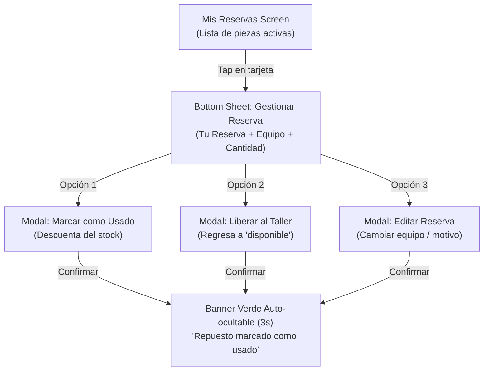

# Auditoría UX/UI & Product Management — Flujo 3: Gestión de Reservas

> [!INFO]
> **Alcance:** Pantalla de gestión personal (`mis_reservas_screen.dart`), modales modulares (`gestionar_reserva_sheet.dart`, `marcar_usado_sheet.dart`, `liberar_repuesto_sheet.dart`, `editar_reserva_sheet.dart`), actualización reactiva y banner de retroalimentación superior.
> **Requerimientos SRS:** RF-06, RF-07, RF-08.

---

## 1. Análisis de Claridad y Fricción

| Elemento Auditado | Diagnóstico UX / Fricción Detectada | Nivel de Impacto | Heurística / Regla Asociada |
|---|---|---|---|
| **Estructura en Bottom Sheets Apilados** | ✅ **Flujo contextual sin pérdida de ubicación:** El técnico nunca abandona la pantalla de sus reservas; los modales inferiores permiten confirmar acciones críticas sin transiciones completas de pantalla. | Positivo | Regla del Pulgar / Thumb Zone |
| **Diferenciación Cromática de Acciones** | ✅ **Prevención de toques destructivos:** "Marcar como Usado" utiliza fondo oscuro/verde de éxito, mientras que "Liberar Repuesto" usa tonos rojo suave de advertencia (`#FFF5F5` y `#DC2626`). | Positivo | Consistencia y estándares / Prevención de errores |
| **Banner Verde Auto-Hide (3 segundos)** | ✅ **Feedback sin bloqueo modal:** Un `AnimatedSwitcher` en la parte superior confirma la transacción exitosa y desaparece solo, sin forzar un tap extra en un botón "OK". | Positivo | Retroalimentación Humana Inmediata |
| **Buscador en "Mis Reservas"** | ✅ **Eficiencia:** Permite filtrar rápidamente por nombre, categoría, motivo o equipo cuando el técnico tiene varias reparaciones concurrentes. | Positivo | Flexibilidad y eficiencia de uso |

---

## 2. Lógica de Negocio y Casos de Cierre del Ciclo de Vida

> [!TIP]
> ### 1. Cierre de Reparación Exitosa: "Marcar como Usado" (RF-07)
> - **Efecto de Negocio:** La pieza pasa de `reservado` a `usado` (descontada del taller físico).
> - **Evaluación:** Elimina la necesidad de reportes manuales en papel. La reserva desaparece de "Mis Reservas" y el inventario total se actualiza en tiempo real.

> [!WARNING]
> ### 2. Cancelación / Diagnóstico Descartado: "Liberar al Taller" (RF-06)
> - **Efecto de Negocio:** Si el cliente rechaza el presupuesto o la pieza no era la necesaria, vuelve inmediatamente a `disponible` para que cualquier otro técnico pueda tomarla.
> - **Evaluación:** Resuelve el problema clásico de talleres donde piezas quedan "bloqueadas" indefinidamente en gavetas de técnicos.

---

## 3. Propuestas de Mejora y Recomendaciones de Producto

1. **Gesto de Deslizar (Swipe-to-Action) Opcional:**
   - *Propuesta:* En la lista de tarjetas de `MisReservasScreen`, permitir deslizar hacia la derecha para "Usar" y hacia la izquierda para "Liberar", acelerando el flujo a técnicos avanzados.
2. **Historial de Repuestos Usados (Pestaña / Filtro Pasivo):**
   - *Propuesta:* Agregar un filtro opcional para ver el historial de piezas que el técnico consumió en los últimos 7 días con fines de trazabilidad.

---

## 4. Veredicto y Calificación

| Criterio | Puntuación | Observación |
|---|:---:|---|
| **Claridad de Interacción** | 9.6 / 10 | Modales contextuales muy claros con feedback sutil. |
| **Cierre de Ciclo de Negocio** | 9.8 / 10 | Cubre el 100% de los estados finales (Usado / Liberado / Editado). |
| **Ergonomía Móvil (Una Mano)** | 9.5 / 10 | Todo se ejecuta en la mitad inferior de la pantalla (Bottom Sheets). |
| **Calificación Global** | **9.6 / 10** | **Sobresaliente / Nivel Producción.** |
