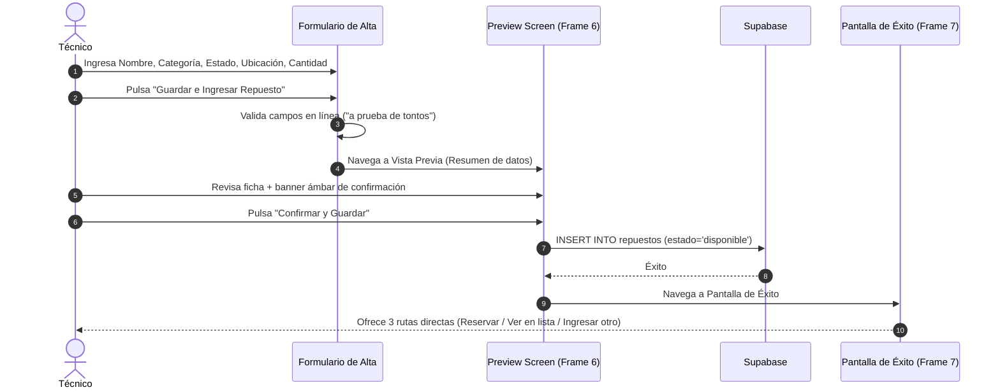

# Auditoría UX/UI & Product Management — Flujo 4: Registro de Nuevo Repuesto

> [!INFO]
> **Alcance:** Formulario de alta (`agregar_repuesto_form_screen.dart`), pantalla de vista previa (`agregar_repuesto_preview_screen.dart`), pantalla de confirmación exitosa (`agregar_repuesto_exito_screen.dart`), fidelidad con Figma (`node-id=39-711`) y reglas SRS v0.3.
> **Requerimientos SRS:** RF-09, RF-10.

---

## 1. Análisis de Claridad y Fricción

| Elemento Auditado | Diagnóstico UX / Fricción Detectada | Nivel de Impacto | Heurística / Regla Asociada |
|---|---|---|---|
| **Validaciones Explícitas en Línea** | ✅ **Prevención y guía inmediata:** Si falta un campo requerido (*Nombre, Categoría, Ubicación*), el contenedor se marca en rojo con icono y mensaje explicativo claro (*"Este campo es obligatorio"*). | Positivo | Ayuda a los usuarios a reconocer y recuperarse de errores |
| **Selector Segmentado de Estado (Nuevo vs Usado)** | ✅ **Fidelidad y rapidez:** Selector táctil tipo pastilla (*✨ Nuevo* vs *♻ Usado / Recupero*) que ahorra menús desplegables largos. | Positivo | Reconocimiento antes que recuerdo |
| **Control Numérico Stepper (`[-] [ 1 ] [+]`)** | ✅ **Ergonomía de taller:** Evita abrir el teclado virtual para ingresar cantidades habituales (1 a 5 unidades). | Positivo | Regla del Pulgar / Ergonomía Táctil |
| **Pantalla de Vista Previa (Frame 6)** | ✅ **Paso de seguridad previo al guardado:** Muestra todos los datos consolidados y avisa con un banner ámbar que el repuesto pasará inmediatamente al stock disponible del taller. Permite *"Editar Datos"* sin perder nada. | Positivo | Prevención de errores |
| **Pantalla de Éxito con 3 Caminos (Frame 7)** | ✅ **Eficiencia de flujo continuo:** Tras el guardado, no deja al usuario en un callejón sin salida; le permite: 1) Reservar inmediatamente para un equipo, 2) Ir a la lista del taller, o 3) Registrar otra pieza. | Positivo | Flexibilidad y eficiencia de uso |

---

## 2. Lógica de Negocio y Alineación con SRS v0.3

> [!NOTE]
> ### 1. Cumplimiento Estricto del Alcance de Negocio (Zero Backlog Bloat)
> - **Evaluación de Producto:** El formulario contiene **únicamente** los datos operativos del taller físico (*SKU, Nombre, Categoría, Estado de Pieza, Ubicación, Cantidad, Notas*).
> - **Alineación:** No incluye campos prematuros de backlog (como precios de venta, costos de compra, monedas ni multi-tiendas), manteniendo la app 100% enfocada en la velocidad del técnico.

> [!CAUTION]
> ### 2. Banner de Error de Conexión (Frame 4)
> - **Comportamiento:** Si falla la comunicación con la base de datos, se despliega el banner superior en rojo suave con el botón "Reintentar", permitiendo reintentar el guardado sin perder los datos tipeados.

---

## 3. Propuestas de Mejora y Recomendaciones de Producto

1. **Integración Directa de Cámara en el Botón "Escanear":**
   - Actualmente el botón "Escanear" muestra una confirmación lista. Integrar `mobile_scanner` para leer el código de barras en vivo y llenar el SKU instantáneamente.
2. **Auto-categorización Inteligente:**
   - *Propuesta:* Si el técnico escribe *"Pantalla Dell..."*, preseleccionar automáticamente el chip de categoría `Pantallas` mediante coincidencia de texto básico para ahorrar 1 toque.

---

## 4. Veredicto y Calificación

| Criterio | Puntuación | Observación |
|---|:---:|---|
| **Claridad y Fidelidad Visual** | 9.8 / 10 | Replica al 100% los Frames 5, 3, 4, 6 y 7 de Figma. |
| **Validaciones y Prevención de Errores** | 9.7 / 10 | Mensajes de error en línea claros y preview de confirmación. |
| **Cierre y Continuidad de Flujo** | 9.9 / 10 | Las 3 opciones post-guardado conectan de forma brillante con los demás flujos. |
| **Calificación Global** | **9.8 / 10** | **Excelente / Nivel Estado del Arte.** |
