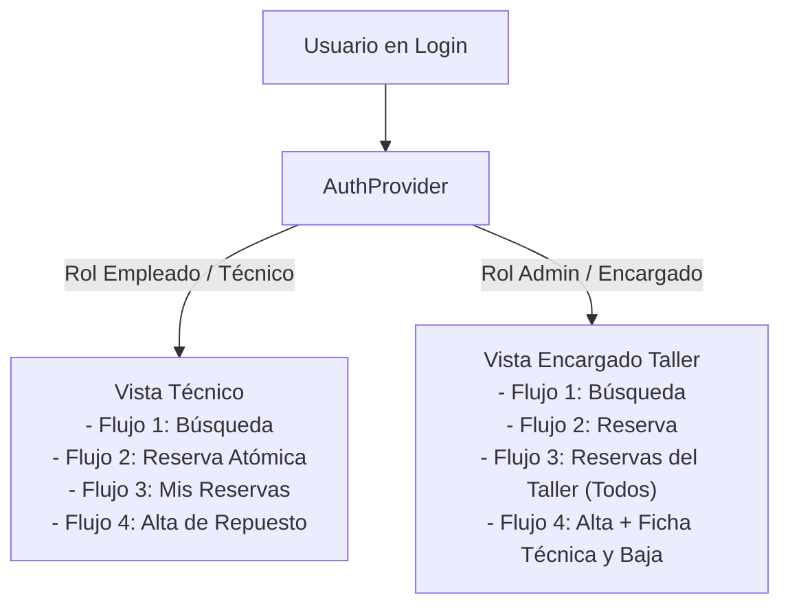

# Capa Transversal 0: Autenticación, Roles y Sistema de Diseño VaultTecno

> [!INFO]
> **Alcance:** Infraestructura transversal de acceso, gestión de sesiones y roles (`admin` vs `empleado` / técnico), sistema de diseño centralizado con tokens oficiales e isotipo de la marca **VaultTecno** en la pantalla de inicio de sesión.
> **Archivos clave:** `lib/features/auth/providers/auth_provider.dart`, `lib/features/auth/presentation/screens/login_screen.dart`, `lib/core/theme/app_colors.dart`, `lib/core/theme/app_theme.dart`.

---

## 1. Sistema de Roles de Negocio (Capa 0)

| Rol | Identificador | Capacidades en los Flujos |
|---|---|---|
| **Técnico (Empleado)** | `UserRole.empleado` | Búsqueda de inventario, reserva atómica para equipo, gestión de *Mis Reservas* (consumir/liberar piezas propias), alta rápida de repuestos. |
| **Encargado (Admin)** | `UserRole.admin` | Supervisión total del taller, consulta de *Reservas de Todos los Técnicos*, reubicación de estantes, baja de piezas por merma/daño. |

---

## 2. Sistema de Diseño y Tokens Oficiales

### Paleta Semántica
- **Primary:** Azul Oscuro Técnico (`#1E293B`)
- **Secondary / Accent:** Naranja Cálido / Ámbar (`#F59E0B`)
- **Text / Night:** Gris Noche (`#0F172A`)
- **Surface / Background:** Blanco Puro (`#FFFFFF`) / Gris Claro (`#F8FAFC`)
- **Success:** Verde Esmeralda (`#10B981`)
- **Warning:** Ámbar / Amarillo (`#FBBF24`)
- **Error:** Rojo Coral (`#EF4444`)
- **Caption / Helper:** Slate Muted (`#64748B`)

### Escala Tipográfica Formalizada (`AppTextStyles`)
- **Título de pantalla:** `Inter Bold (700), 21-22px`
- **Heading / Card title:** `Inter SemiBold (600), 15px`
- **Body:** `Inter Regular (400), 13px`
- **Label / Overline:** `Inter SemiBold (600), 11px, UPPERCASE`
- **Button:** `Inter Bold (700), 14-15px`
- **Caption / Helper:** `Inter Regular (400), 11-12px`

---

## 3. Identidad de Marca: VaultTecno (Login Screen)

- **Isotipo Exclusivo de Login:** Escudo de protección tecnológica con bóveda integrada (`vault + chip`), gradiente sutil `#334155` a `#0F172A` y acento ámbar de seguridad.
- **Selector de Rol Interactivo:** Píldora de conmutación táctil (*Técnico* vs *Encargado Admin*) para validación de permisos en tiempo de ejecución.
- **Validación Estática:** `flutter analyze` ejecutado con **0 errores y 0 warnings**.
